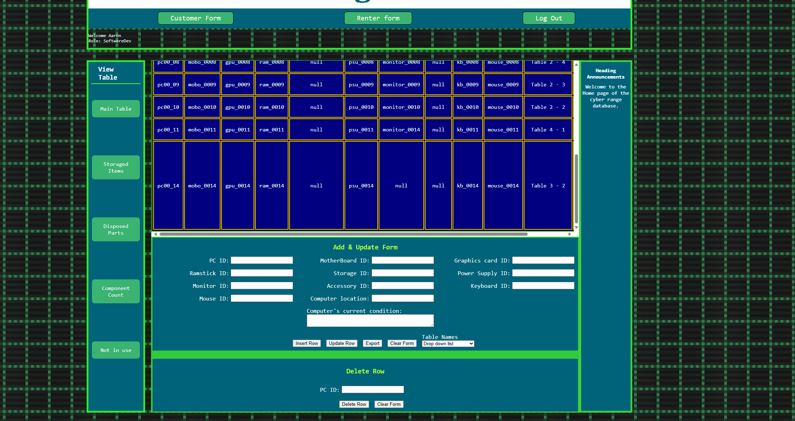

# Main Inventory System

The Main Inventory System is a web-based application for technical staff and administrators to track, manage, and report on IT and lab assets. These assets include composite PC setups, peripherals (keyboards, mice, monitors), components (GPUs, RAM, motherboards, power supplies, etc.), storage devices, and employee/user accounts. The system enforces referential integrity, employee roles, and provides summary analytics via reporting views.

---

## Features

- Add, edit, delete, and view all asset/component types
- Composite PC setup management (linking existing components)
- Employee account management with roles (DBA, FullTime, SoftwareDev)
- Status, condition, and location tracking for all assets
- Storage and storage slot management
- Reporting dashboards using live database views
- CSV export for all reports
- Secure authentication and role-based access

---
## Documentation

- [User Guide](Docs/Inventory%20System%20docs/Inventory_System_User_Guide_Version2.md)
- [Developer Guide](Docs/Inventory%20System%20docs/Inventory_System_Developer_Guide_Version2.md)
- [Design Document](Docs/Inventory%20System%20docs/Inventory_System_Requirements_UPDATED_Version2.md)
- [API Documentation](Docs/Inventory%20System%20docs/docs_API_DOCUMENTATION_Version2.md)
- [Installation Instructions](Docs/Inventory%20System%20docs/docs_INSTALLATION_Version2.md)
- [Changelog](Docs/Inventory%20System%20docs/CHANGELOG_Version2.md)
- [Contributing](Docs/Inventory%20System%20docs/CONTRIBUTING_Version2.md)

---

## Quick Start

See [Installation Instructions](Docs/Inventory%20System%20docs/docs_INSTALLATION_Version2.md) for complete setup instructions.

---

## Reporting Bugs and Requesting Features

- Please use [Contributing](Docs/Inventory%20System%20docs/CONTRIBUTING_Version2.md) for guidelines on how to report issues, request features, and contribute code.

Here's a few walkthroughs

